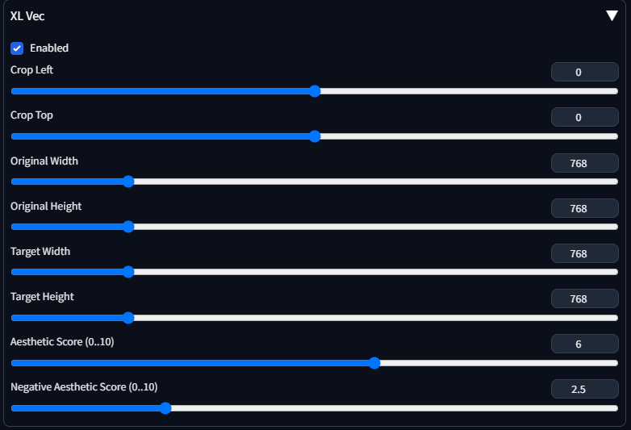
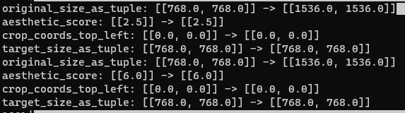

# XL Vec

## What is this?

This is an extension for [stable-diffusion-webui](https://github.com/AUTOMATIC1111/stable-diffusion-webui) which overwrites SDXL's CLIP outputs.

## Usage

Input values as you like.



Overwritten values are dumped into stdout.



## Examples

```
Hassaku XL alphaV0.7 / DPM++ 3M SDE / 30 steps / 576x1024
Prompt: a cute girl sitting in flower garden, clear anime face, insanely frilled white dress, absurdly long brown hair, small silver tiara, long sleeves highneck dress, looking at viewer
Negative Prompt: maid
```

See PNGInfo for details.

### Crop Top


### Original Width/Height


### Token Multiplier


