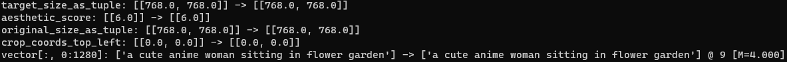

# XL Vec

## What is this?

This is an extension for [stable-diffusion-webui](https://github.com/AUTOMATIC1111/stable-diffusion-webui) which overwrites SDXL's CLIP outputs.

## Usage

Input values as you like.

Overwritten values are dumped into stdout.

